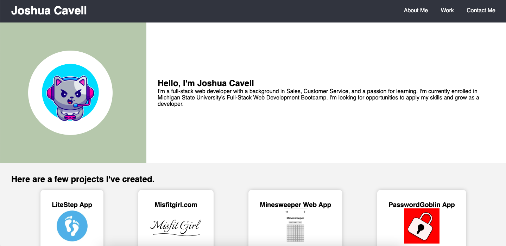

# Portfolio

## Hello, This is my portfolio project for Module #2 for MSU Bootcamp.

I tried to create an eye appealing webpage that is fully dynamic, and mobile first.

It contains a header with my name and navigational links leading to each section of the website via anchor tags.

The first section tells the user a little about me, The next section showcases my recent coding projects. Each project is inside a card element with an image representing that project. Each project contains a url leading to that project.

The last section contains a button element with a email address link.

At the very bottom the website has a footer with a small text thanking the visitor.

[Link to working example](https://xclusive36.github.io/Portfolio/)